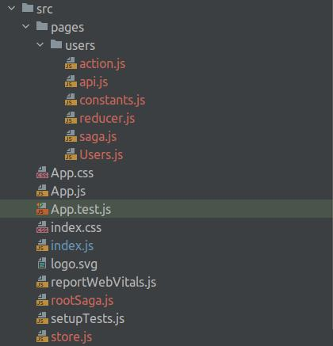

# Sagavox: React Redux Saga Generator

This packages works with `npx create-react-app`. So if you want to use it, It's suggested that use it after main
installation of react project.

# TL;DR

Install the package: ```npm install sagavox```

Initial react-redux saga project: ```sagavox -i```

Making a new page wrapped by redux saga technology: ```sagavox -p```

## React Version Compatibility

- This packages works with react@^18 successfully. I didn't test it with other versions.
- *Notice: This version probably doesn't work fine with the React TypeScript template.*

## Installation

Install by npm

```npm install sagavox```

## Dependencies

Before use this package, please make sure that you installed these packages:

* `npm install react-redux`
* `npm install redux-saga`
* `npm install @reduxjs/toolkit`
* `npm install axios`

## Usage

After installation, you can use the terminal to run this package's command to generate your delighted files.

### Initialize

If your project is still raw, and you didn't configure it for redux-saga, you can change your project to a 
react-redux-saga by running this command:

***Notice: DO NOT RUN THIS COMMAND MORE THAN ONCE!***

```sagavox --init``` or shorter one ```sagavox -i```

#### Screenshots

**Before `sagavox -i` command:**


**After `sagavox -i` command:**


### Make a new page

To make a new page for your project and add its necessary files magically, run this command:

```sagavox --page <PAGE-NAME>``` or shorter one ```sagavox -p <PAGE-NAME>```

Also, it's possible to run in this way: ```sagavox --page``` or ```sagavox -p``` without page name, and it will ask you 
the name in the terminal.

#### Screenshots

**After `sagavox -p users` command:**



## Support

Feel free to submit an issue on the [GitHub repo](https://github.com/erfanatp/sagavox/issues).

## Contribute

I believe there is no perfection in the world! So if you think that you can improve this package, let's contribute by the pull requests!

If your pull requests makes documentation changes, please update readme file.

## License

This project is licensed under the terms of the MIT license.

## Thanks

With great thanks from [{JSON} Placeholder](https://jsonplaceholder.typicode.com/).
